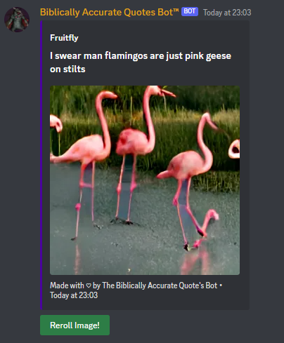
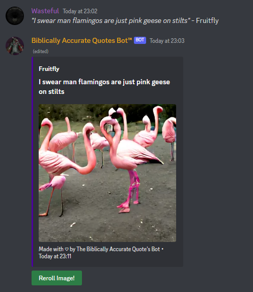

 

---

## What does this bot do?
This is a discord bot me and [I-Chlo](https://github.com/I-Chlo) made for our games server. Using the Dall-e Mini ai to generate the images via the [unofficial craiyon api](https://github.com/jozsefsallai/node-craiyon). This allows for our discord quote channel to have complimentary images to go along with funny quotes from gaming sessions  

## Tools used
- PM2 for running a daemon instance of the application
- EC2 AWS for hosting the discord bot
- Discord.js library for interacting with discord
- ESLint for coding standards
- Node runtime to run the code outside of a browser
- Jest testing library for some non discord js testing
  
### Example: 

The Reroll button allows the user to change their image to another generated image from a selection of 9 different potential images

